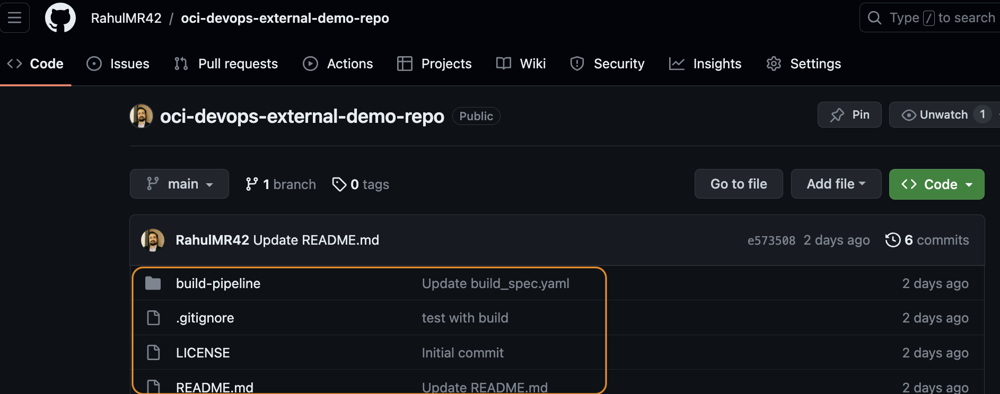
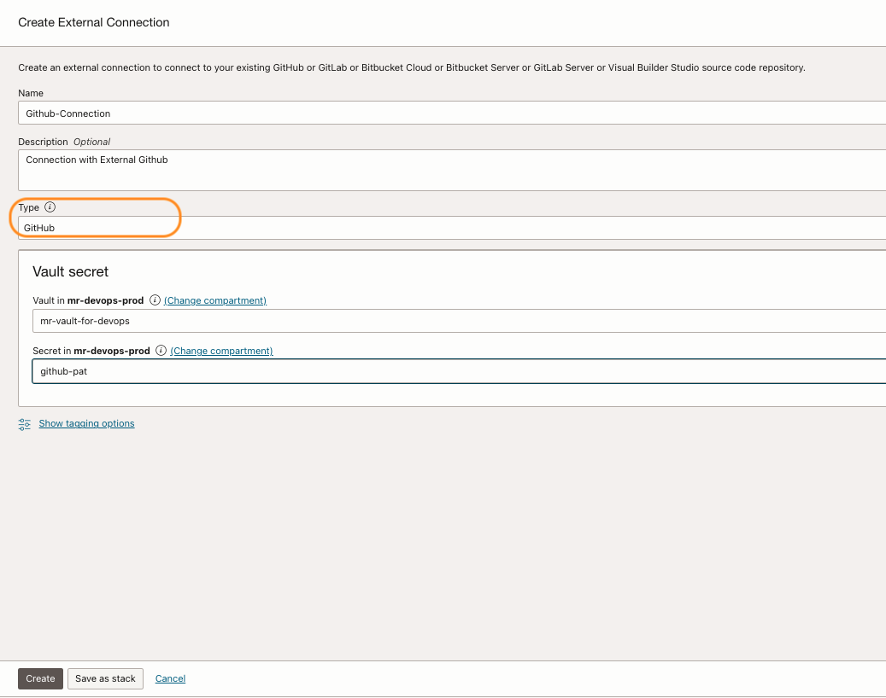
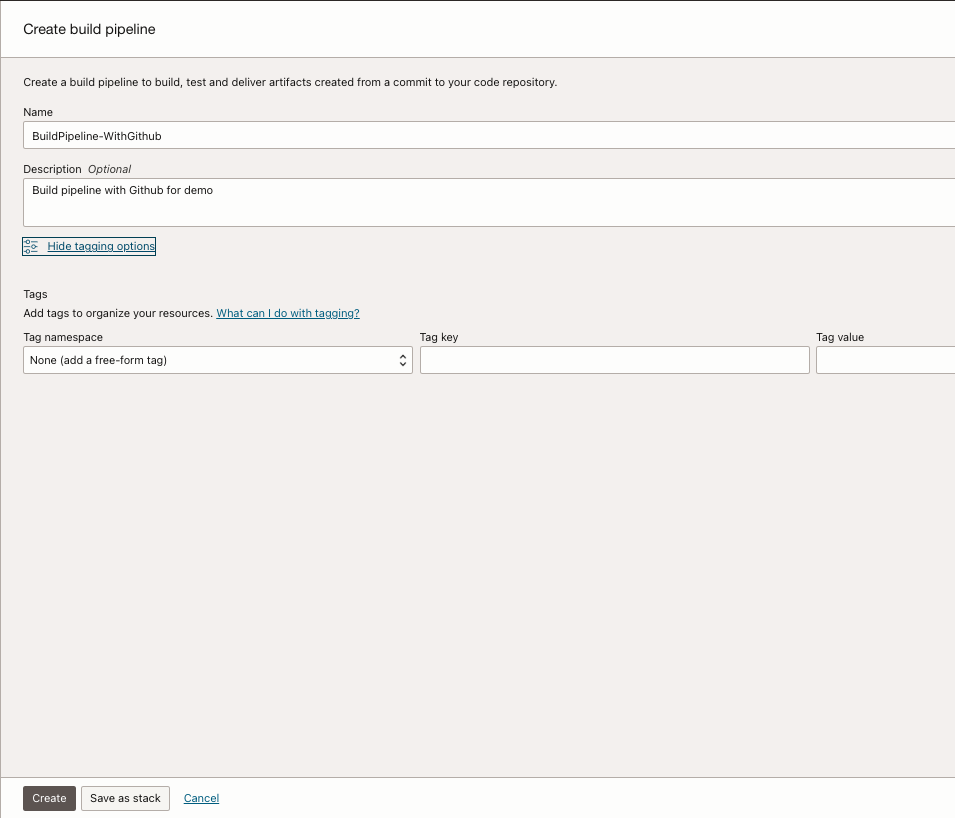
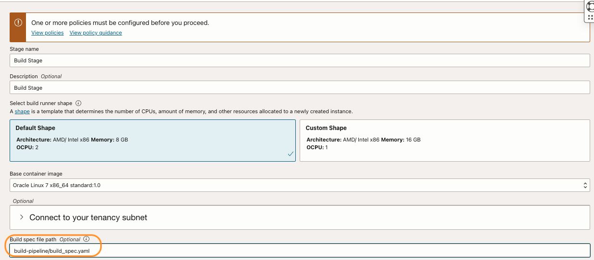
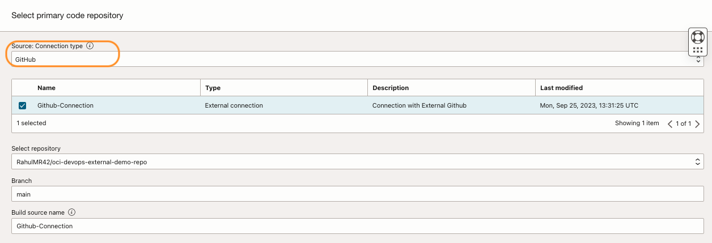
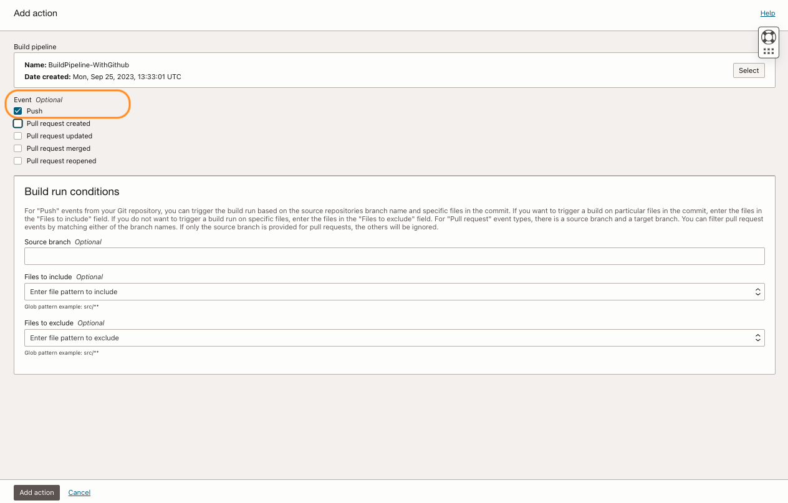
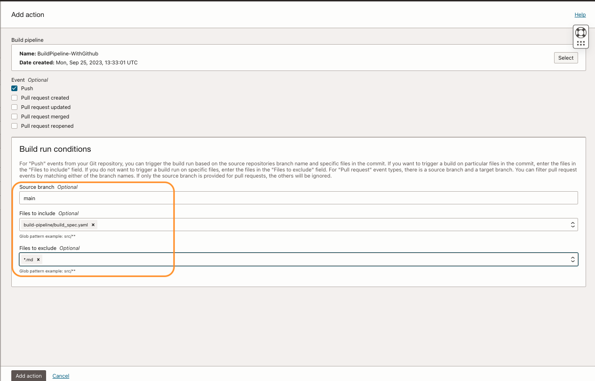
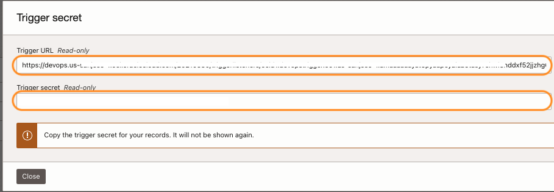
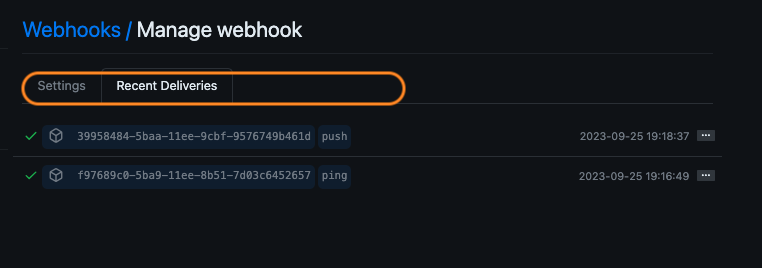
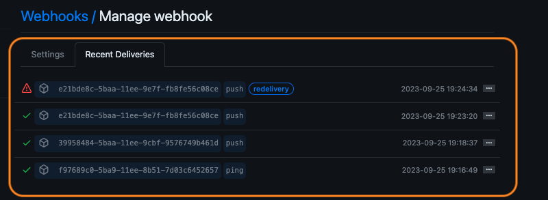

## Sample of **File-based Trigger Trigger** -  Trigger an OCI DevOps Build pipeline with an external code repo (Github).


In Oracle Cloud Infrastructure (OCI) DevOps, a build run can be automatically triggered when you commit your changes to a code repository.

You can control the trigger action by specifying the modified files in your repository to be included or excluded during the build run. The file-based trigger action is applicable only for the **Push** event.


### External Connection.
With external connection the OCI DevOps build pipeline and triggers can connect to external repositories such as GitHub, GitLab, Bitbucket Cloud, Visual Builder Studio, Bitbucket Server, and GitLab Server.

In this example, we will be using a repo from the Github repo. To establish and use the external repo from Github we will be using Github PAT stored under OCI Vault.

### File-Based Trigger
For triggering a build run based on file changes, the following two options are provided:

**Files to include**: By default, changes to all files in the repository are included when a build run is triggered. The Files to Include option allows you to specify a list of files and directories in the repository that you have changed and for which you want to trigger a build run. Files are specified using glob patterns. Trigger action is based on the changes affecting at least one of the included files.

**Files to exclude**: By default, changes to all files in the repository are included when a build run is triggered. The Files to Exclude option allows you to specify a list of files and directories in the repository that you want to exclude from the build run. Files are specified using glob patterns. Changes affecting only the excluded files do not trigger a build. If files are specified for both include and exclude, then the exclude filter is applied to the output of the include filter.


#### Objectives

- Create GitHub PAT and store it within OCI Vault.
- Create an external connection within OCI DevOps.
- Create a build pipeline with an external code repo.
- Create a devops trigger.
- Test and validate trigger conditions.

### Procedure

#### OCI Notifications.

- Create an OCI notification topic - https://docs.oracle.com/en-us/iaas/Content/Notification/Tasks/managingtopicsandsubscriptions.htm#createTopic


#### OCI Identity setups.

- Create a dynamic group and add the below rules. -

```java
ALL {resource.type = 'devopsbuildpipeline', resource.compartment.id = 'COMPARMENT OCID'}
ALL {resource.type = 'devopsrepository', resource.compartment.id = 'COMPARMENT OCID'}
ALL {resource.type = 'devopsconnection',resource.compartment.id = 'compartmentOCID'}
```

- Create a policy with the below statements.

```java
Allow dynamic-group "NAME OF THE DynamicGroup" to manage repos in compartment "COMPARTMENT NAME"
Allow dynamic-group  "NAME OF THE DynamicGroup" to use ons-topics in compartment "COMPARTMENT NAME"
Allow dynamic-group  "NAME OF THE DynamicGroup" to read secret-family in compartment "COMPARTMENT NAME"
```
- If the user is not part of the `Tenancy Administrator` group, the user group needs an additional policy statement to validate the external connection. It is an optional policy statement.
```java
Allow group "Name of the User Group Name" to use DevOps-connection in compartment "COMPARTMENT NAME"
```
#### Github Initial setup.
- Login to GitHub and create a new repo.
- Push the repo content here to the Github repo.
  
- Refer [Github official documentation](https://docs.github.com/en/authentication/keeping-your-account-and-data-secure/managing-your-personal-access-tokens) and create a personal access token, it can be a classical token or a fine-grained-token for specific repo.
- Make a note of GitHub PAT.
#### OCI Vault setup.
- Create a vault - https://docs.oracle.com/en-us/iaas/Content/KeyManagement/Tasks/managingvaults_topic-To_create_a_new_vault.htm#createnewvault
- Create a master key - https://docs.oracle.com/en-us/iaas/Content/KeyManagement/Tasks/managingkeys_topic-To_create_a_new_key.htm#createnewkey
- Create a secret and add the GitHub PAT value.
  
#### OCI DevOps setups.
- Create a DevOps project and associate it with the notification topic - https://docs.oracle.com/en-us/iaas/Content/devops/using/create_project.htm
  
- Ensure to enable logging for the projects.
- Create an `External Connection`. - https://docs.oracle.com/en-us/iaas/Content/devops/using/create_connection.htm
- Open the navigation menu and click Developer Services. Under DevOps, click Projects.
- Select a project and from the left-side menu, click External Connections.
- Click Create External Connection.
  
- Provide a `name` and `description`.Select the type `Github`.
  
- Select the `Vault` created and the `secret` which contains the PAT.
- Click `Validate connection` and verify the connection is valid
  
- If the validation is successful, then a success message is displayed. Otherwise, a failure message is displayed. If the validation fails, you must generate a PAT and store your PAT securely in an OCI vault. You can then update the vault secret by editing the connection details.
- Create a `Build pipeline`.
  
- With in build pipeline add a `managed build stage`.
- Provide a name and description for the stage.
- Provide path `build-pipeline/build_spec.yaml` as the path for `build spec file path`.
  
- Select the primary code repository, select the connection type as `Github` and the `External connection` created.
- Select the appropriate GitHub repo and branch.
  
- Once the repo is selected create the stage. The build pipeline will look as below.
  
#### OCI DevOps trigger conditions with External connection.
In Oracle Cloud Infrastructure (OCI) DevOps, a build run can be automatically triggered when you commit your changes to a code repository. In the DevOps service, you can create your private code repositories or connect to external code repositories and trigger the build
* Open the navigation menu and click Developer Services. Under DevOps, click Projects.
* On the DevOps Projects page, select a project.
* On the details page of the project, from the left side, click Triggers.
* Click Create Trigger.
  
- Enter a name select the external connection as Github and select the connection created.
  
- With in action select the `Build pipeline` and event type as `push`.
  
  
- Select the `branch`,` files to include` and `files to exclude`.In this sample, we will add the trigger for path `build-pipelines/build_spec.yaml` and exclude all *.md file changes.
  
- Add the actions and create the trigger. Copy the URL and secrets that will be prompted on the screen.
  

#### GitHub Webhook configurations.
- Follow GitHub official documentation to create the webhook against the repo - https://docs.github.com/en/webhooks/using-webhooks/creating-webhooks
  
- Within webhook use the URL received and secrets from OCI DevOps trigger as Payload URL and Secret respectively. Use `application/json as the content type.
  
- As soon as the webhook is created, a test ping event will be triggered from GitHub using the payload URL and secrets. The details can be found in the `recent deliveries` tab against the webhook created.
  
  

#### Test & Validate the Triggers
- Update the file `build-pipeline/build_spec.yaml` add an echo statement to the end of the steps and commit to the repo.
  
- Check for the recent deliveries under webhook for the `push ' action.
  
- Verify the request and response to validate the trigger.
  
- With in build pipeline, check for build history and you should see a new build run.
  
- To validate the file-based trigger file exclusion, edit and add some comments to the `README.md`.Commit the changes back to the repo.
  
- Verify the webhook under `recent deliveries`.It should show a response code for `202` as there is no valid condition (due to exclusion) to trigger a build run.
  
- Incas of a failure of webhook, validate it via request and response to know more.
  

Contributors
===========
- Author: Rahul M R.
- Collaborators: NA
- Last release: September 2023

